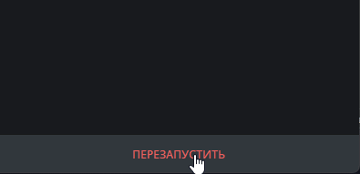

# 🤖 aiobtcbottg

Простой Telegram-бот, который показывает актуальный курс
**Bitcoin (BTC)** и **Ethereum (ETH)** по команде `/price`.

Бот написан на Python с использованием `aiogram` и бесплатного API CoinGecko.

---

## 🚀 Возможности
- 💰 Отображение курса Bitcoin и Ethereum
- ⏱ Актуальные данные в реальном времени
- ⚡ Асинхронная работа
- 🆓 Бесплатный API (без ключей)

---

<p align="center">
  
</p>
<p align="center"><i>Пример работы команды /price</i></p>


## 🛠 Стек технологий


---

## ⚙️ Установка и запуск

```bash
git clone https://github.com/NESTREN/aiobtcbottg.git
cd aiobtcbottg
pip install -r requirements.txt
python bot.py
